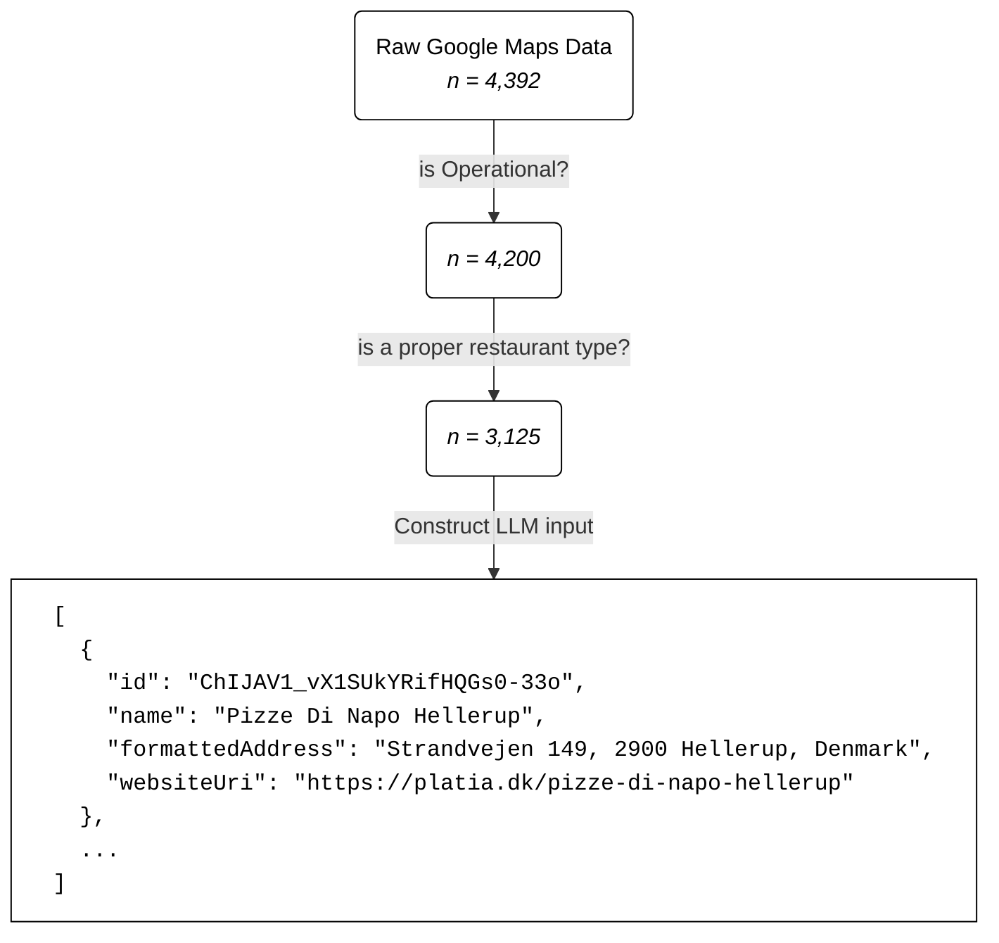

```mermaid
---
config:
  flowchart:
    wrappingWidth: 2000
---
flowchart TB
    raw("Raw Google Maps Data<br><i>n = 4,392</i>") -- is Operational? --> op("<i>n = 4,200</i>")
    op -- is a proper restaurant type? --> proper("<i>n = 3,125</i>")
    proper -- Construct LLM input --> input["[<br>&nbsp;&nbsp;{<br>&nbsp;&nbsp;&nbsp;&nbsp;#quot;id#quot;: #quot;ChIJAV1_vX1SUkYRifHQGs0-33o#quot;,<br>&nbsp;&nbsp;&nbsp;&nbsp;#quot;name#quot;: #quot;Pizze Di Napo Hellerup#quot;,<br>&nbsp;&nbsp;&nbsp;&nbsp;#quot;formattedAddress#quot;: #quot;Strandvejen 149, 2900 Hellerup, Denmark#quot;,<br>&nbsp;&nbsp;&nbsp;&nbsp;#quot;websiteUri#quot;: #quot;https://platia.dk/pizze-di-napo-hellerup#quot;<br>&nbsp;&nbsp;},<br>&nbsp;&nbsp;...<br>]"]

     raw:::plain
     op:::plain
     proper:::plain
     input:::code
    classDef plain fill:#fff,stroke:#000,color:#000
    classDef code fill:#fff,stroke:#000,color:#000,font-family:monospace,text-align:left,white-space:nowrap
    style raw stroke-width:1px,stroke-dasharray: 0
    style op stroke-width:1px,stroke-dasharray: 0
    style proper stroke-width:1px,stroke-dasharray: 0
    style input stroke-width:1px,stroke-dasharray: 0
```
