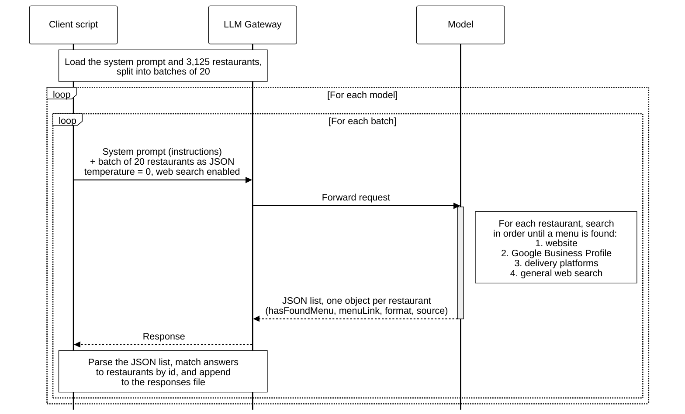

```mermaid
---
config:
  theme: base
  themeVariables:
    primaryColor: "#fff"
    primaryBorderColor: "#000"
    primaryTextColor: "#000"
    lineColor: "#000"
    actorBkg: "#fff"
    actorBorder: "#000"
    signalColor: "#000"
    signalTextColor: "#000"
    noteBkgColor: "#fff"
    noteBorderColor: "#000"
    noteTextColor: "#000"
    labelBoxBkgColor: "#fff"
    labelBoxBorderColor: "#000"
    loopTextColor: "#000"
    activationBkgColor: "#eee"
    activationBorderColor: "#000"
  sequence:
    mirrorActors: false
    messageAlign: center
---
sequenceDiagram
    participant S as Client script
    participant G as LLM Gateway
    participant M as Model

    Note over S,G: Load the system prompt and 3,125 restaurants,<br>split into batches of 20

    loop For each model
        loop For each batch
            S->>G: System prompt (instructions)<br>+ batch of 20 restaurants as JSON<br>temperature = 0, web search enabled
            G->>M: Forward request
            activate M
            Note right of M: For each restaurant, search<br>in order until a menu is found:#nbsp;<br>1. website<br>2. Google Business Profile<br>3. delivery platforms<br>4. general web search
            M-->>G: JSON list, one object per restaurant<br>(hasFoundMenu, menuLink, format, source)
            deactivate M
            G-->>S: Response
            Note over S,G: Parse the JSON list, match answers<br>to restaurants by id, and append<br>to the responses file
        end
    end
```
