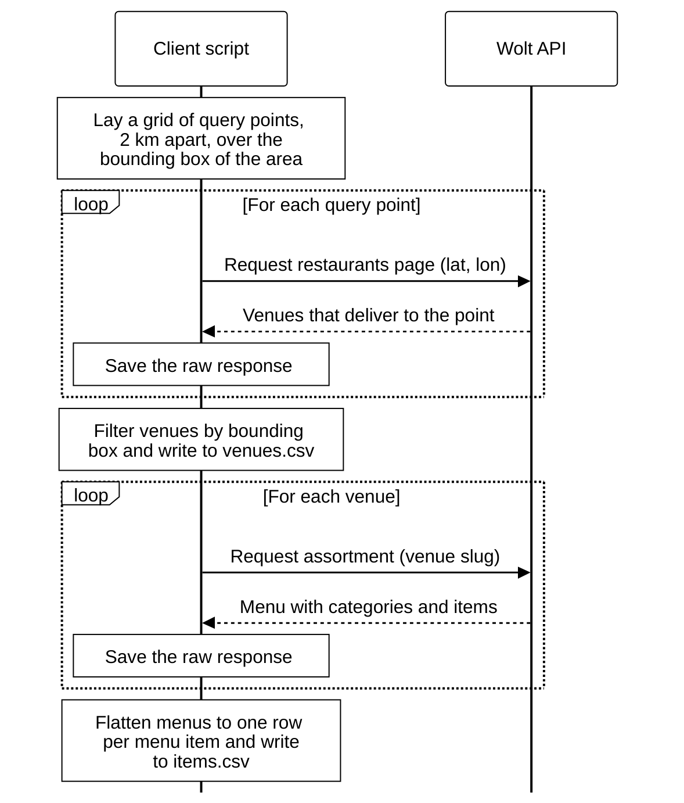

```mermaid
---
config:
  theme: base
  themeVariables:
    primaryColor: "#fff"
    primaryBorderColor: "#000"
    primaryTextColor: "#000"
    lineColor: "#000"
    actorBkg: "#fff"
    actorBorder: "#000"
    signalColor: "#000"
    signalTextColor: "#000"
    noteBkgColor: "#fff"
    noteBorderColor: "#000"
    noteTextColor: "#000"
    labelBoxBkgColor: "#fff"
    labelBoxBorderColor: "#000"
    loopTextColor: "#000"
    activationBkgColor: "#eee"
    activationBorderColor: "#000"
  sequence:
    mirrorActors: false
    messageAlign: center
---
sequenceDiagram
    participant S as Client script
    participant W as Wolt API

    Note over S: Lay a grid of query points,#nbsp;<br>2 km apart, over the<br>bounding box of the area

    loop For each query point
        S->>W: Request restaurants page (lat, lon)
        W-->>S: Venues that deliver to the point
        Note over S: Save the raw response#nbsp;
    end

    Note over S: Filter venues by bounding#nbsp;<br>box and write to venues.csv

    loop For each venue
        S->>W: Request assortment (venue slug)
        W-->>S: Menu with categories and items
        Note over S: Save the raw response#nbsp;
    end

    Note over S: Flatten menus to one row#nbsp;<br>per menu item and write<br>to items.csv
```
